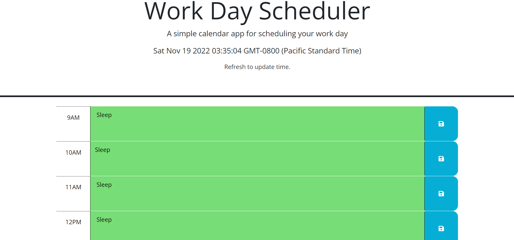

# Calendar

## Description

A calendar to help you schedule your day. Time, day, and date is listed. Time blocks for working hours (9AM-5PM) are available for you to enter and save events into.

## Usage

Time blocks are color coded to signify if an even has passed (grey), ongoing (red), or upcoming (green). Type an event or activity into the time block and click the save button on the side to view your saved event at a later time.

